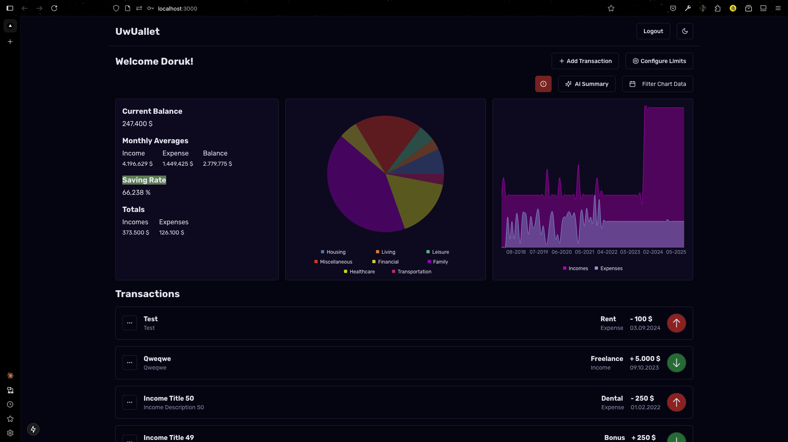
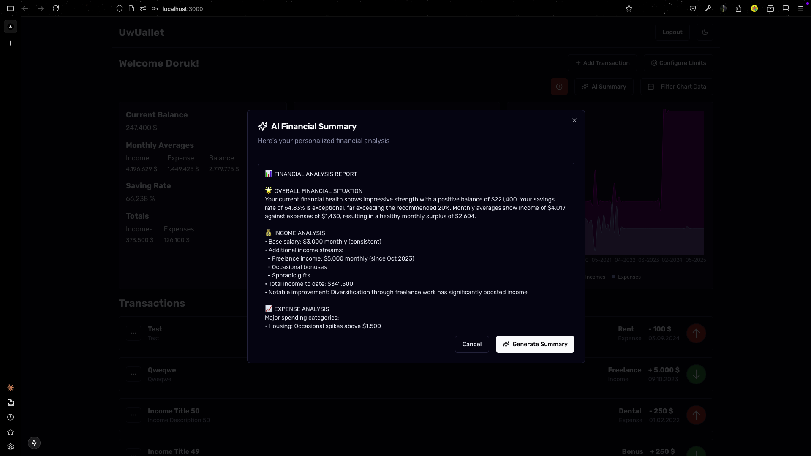
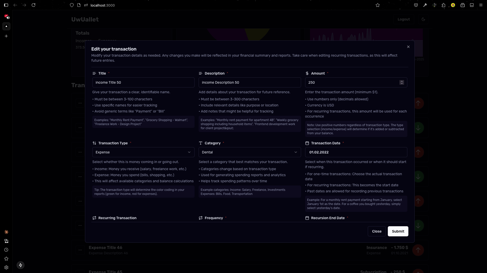

# UwUallet

### Why build another expense tracker?

I just want to practice and improve my TS, NextJS, React, and Backend skills so why not?

### Note

Due to react 19 and NextJS security updates versions are outdated and broken. Treat this project as a example for server actions, mongodb, and frontend boilerplate. Don't wanna spend time to fix versions.

### Features

- Simple cookie based authentication with login and register server actions
- Create, update, delete transactions
- Fully predefined form schemas and custom invalid field messages
- Authentication checks on private server events
- Fetch and process transactions (expenses/incomes) data to display meaningful content on dashboard
- Calculate and display balance, total incomes, total expenses, savings rate, monthly averages based on user transactions data
- Process transactions data to display expenses distribution pie chart with date filtering
- Process transactions data to display monthly expenses, incomes bar chart with date filtering
- Add limits to each expense group for alerting user based on exceeding monthly expenses
- Simple yet functional, clean UI focused on simplicity
- Generate AI summary for your transactions data and get suggestions/reviews from AI, currently disabled for all users except admin to not exceed my anthropic usage limit

### Features that I may add in future

- Instead of linking transactions to users with username, I may link them with user \_ids
- I may add email verification for register step, and password reset functionality
- I may add more detailed/advanced analysis reports and charts
  - Daily transactions data processing, currently all data is generated months based
  - Analytics/Reports that can be added are
    - Weekday vs Weekend Spendings
    - Recurring vs One time transactions
    - Monthly comparison
    - Projected balance
    - Projected savings
    - Average daily spendings
    - Highest spending day
    - Lowest spending day
    - Category spending rate
    - Unusual spendings
    - Seasonal Trends
  - Creating custom charts for all possible analytics/reports additions
- More customized AI suggestions and reviews based on new analytics/reports additions
- Design updates to make app even better
- Encrypt user's data so only user can decrypt and see it
  - I don't know how I can do this but it can be a nice know-how gain and privacy improvement
- Allow users to select their main currency to calculate balance,
- Allow users to add transactions with different currencys
